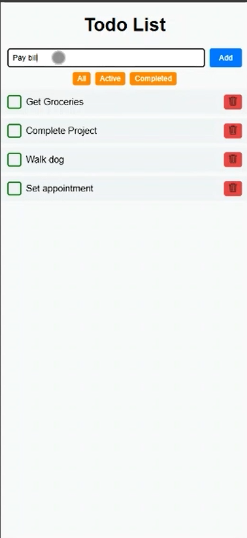
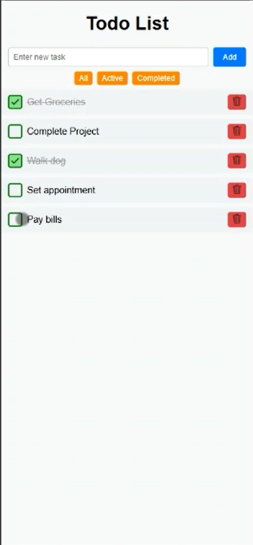
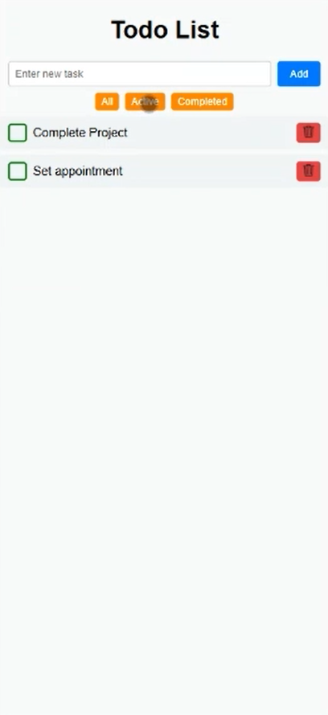
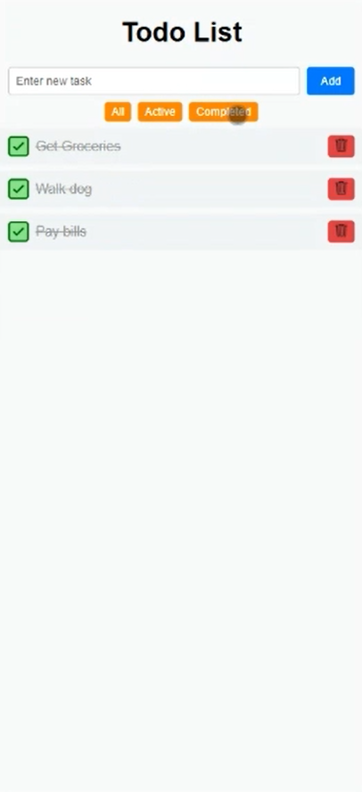
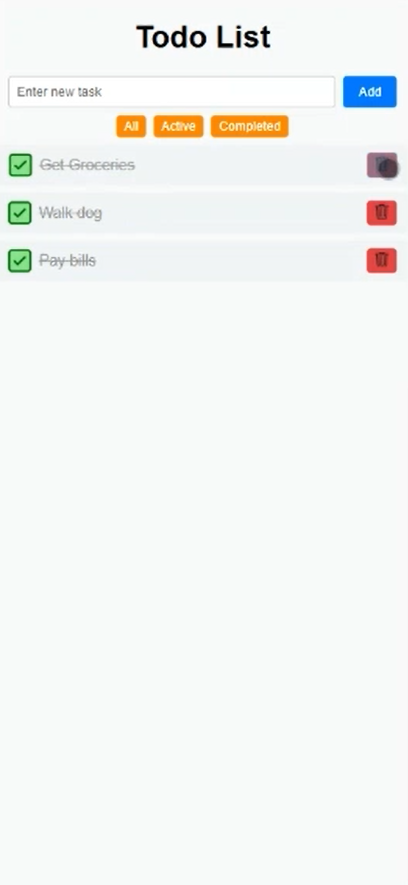
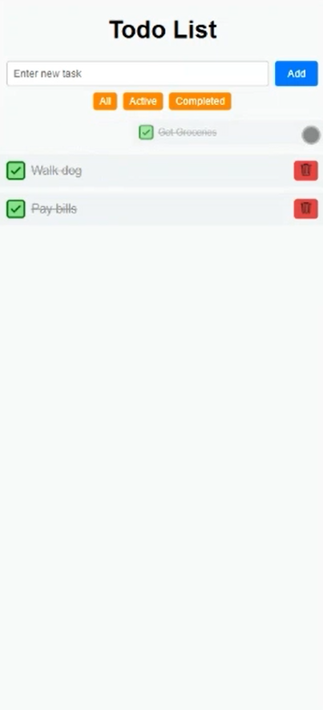
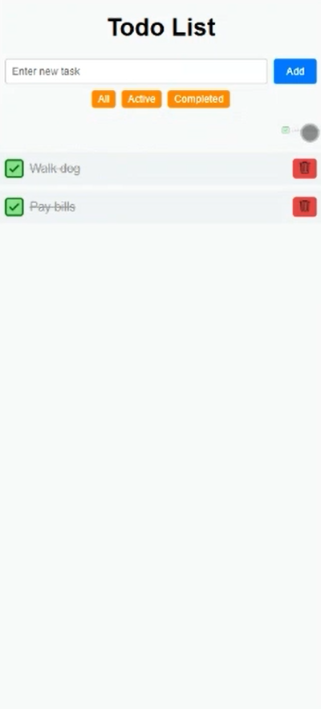

# React To-Do List ✅

A simple, clean, and responsive to-do list application built using **React**. This app allows users to add, delete, and mark tasks as complete, with a dynamic user interface that supports drag-and-drop task reordering and optional styling enhancements.

## ✨ Features

- 📝 Add and delete tasks
- ✅ Mark tasks as complete/incomplete
- 🔁 Reorder tasks via drag-and-drop
- 💾 Persist tasks in local state
- 🎨 Clean, modern UI with modular components

## 📸 Screenshots









## 🛠️ Built With

- [React](https://reactjs.org/)
- [JavaScript](https://developer.mozilla.org/en-US/docs/Web/JavaScript)
- [CSS](https://developer.mozilla.org/en-US/docs/Web/CSS)

## 📦 Getting Started

Follow these steps to run the project locally:

### Prerequisites

- Node.js (v18 or higher recommended)
- npm or yarn

### Installation

```bash
# Clone the repository
git clone https://github.com/RJYoung7/react-todo-list.git

# Navigate into the project directory
cd react-todo-list

# Install dependencies
npm install

# Start the development server
npm start
```
